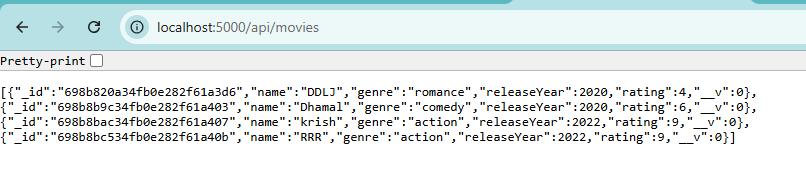
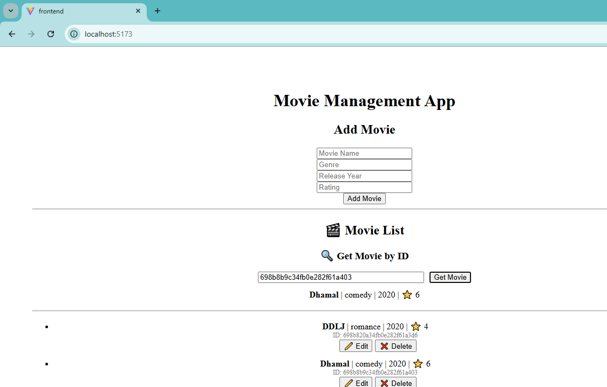

# Full-Stack Movie Management Application

A simple full-stack app for managing movie data with a Node.js/Express API, MongoDB, and a React + Vite frontend.

## Features
- Create, read, update, and delete movies
- RESTful API with proper status codes
- Simple, clean UI

## Tech Stack
- Backend: Node.js, Express.js, MongoDB (Mongoose), Nodemon
- Frontend: React, Vite, JavaScript, HTML, CSS
- Tools: VS Code, Git/GitHub, Postman/Thunder Client

## Setup
### Prerequisites
- Node.js (LTS)
- npm
- MongoDB (local or Atlas)

### Backend
```bash
cd backend
npm install
```

Create a `.env` file inside the `backend` folder and add your MongoDB connection string.

Example `backend/.env`:
```
MONGODB_URI=mongodb://127.0.0.1:27017/movies_db
# Optional: PORT=5000
```

The backend loads environment variables with `dotenv` and reads the connection string from `process.env.MONGODB_URI` in `backend/config/db.js`.

Start the server:
```bash
cd backend
npm install
npm run dev
```
API runs at: `http://localhost:5000`

### Frontend
```bash
cd frontend
npm install
npm run dev
```
Frontend runs at: `http://localhost:5173`

## API
Base URL: `http://localhost:5000/api/movies`

Create movie:
```http
POST /api/movies
```
```json
{
  "name": "DDLJ",
  "genre": "Romance",
  "releaseYear": 2020,
  "rating": 4
}
```

Get all movies:
```http
GET /api/movies
```

Get movie by ID:
```http
GET /api/movies/:id
```

Update movie:
```http
PUT /api/movies/:id
```
```json
{
  "name": "DDLJ Updated",
  "genre": "Romance",
  "releaseYear": 2021,
  "rating": 5
}
```

Delete movie:
```http
DELETE /api/movies/:id
```

## Project Structure
```
movie-app/
+-- backend/
�   +-- config/
�   +-- models/
�   +-- routes/
�   +-- server.js
�   +-- package.json
+-- frontend/
�   +-- src/
�   �   +-- components/
�   �   +-- App.jsx
�   �   +-- main.jsx
�   +-- package.json
+-- README.md
```

## Repository

`https://github.com/ganu121/Full-Stack-Movie-Management-Application.git`

**Backend**


**Frontend**


## Author
Ganesh Malji
